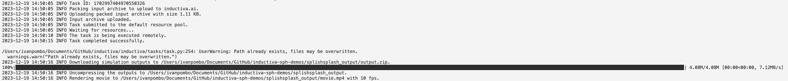

## Running an SPH Simulation

This section assumes users know how to configure a SplishSplash and/or DualSPHysics
simulation, in which case our **Inductiva API client** provides a simple interface to run
those simulations at scale. Users are, in any case, invited to consult the relevant documentation
for each of those simulation engines (links
[here](https://github.com/InteractiveComputerGraphics/SPlisHSPlasH) and
[here](https://github.com/DualSPHysics/DualSPHysics), respectively). 

Let's demonstrate how to use two SPH simulators with **Inductiva API**.

### SplishSplash

SplishSplash is simple to run and the simulator is simply configured via a few configuration files.
The required one is a `.json` file that contains the parameters of the simulation.
The others are extra input files that determine the geometry and properties of the
objects and fluids in the simulation.

```python
import inductiva

input_dir = inductiva.utils.files.download_from_url(
    "https://storage.googleapis.com/inductiva-api-demo-files/"
    "splishsplash-input-example.zip", unzip=True)

# Set simulation input directory
splishsplash = inductiva.simulators.SplishSplash()

task = splishsplash.run(input_dir=input_dir,
                        sim_config_filename="config.json")

# Wait for the simulation to finish
task.wait()
task.download_outputs()
```

As soon you launch the simulation with this script, you will receive the following
logs telling how the simulation is going:




### DualSPHysics

DualSPHysics has a more complex configuration and requires that users select the commands to
be executed. The commands are defined in a list of dictionaries, where each dictionary contains
the command to be executed and the prompts to be answered. The prompts are the questions that
the simulator asks during the execution of the command. The main input file for this simulation
is a `.xml` file that contains the parameters of the simulation. The others are extra input
files that determine the geometry and properties of the objects and fluids in the simulation.

```python
import inductiva

# Download the configuration files into a folder
input_dir = inductiva.utils.files.download_from_url(
    "https://storage.googleapis.com/inductiva-api-demo-files/"
    "dualsph-duck-input-example.zip", unzip=True)

commands = [
    {"cmd": "gencase floating_duck floating_duck -save:all", "prompts": []},
    {"cmd": "dualsphysics -mdbc floating_duck floating_duck -dirdataout data -svres", "prompts": []},
    {"cmd": "boundaryvtk -loadvtk AutoActual -motiondata floating_duck/data" \ 
            "-savevtk floating_duck/boundary/duck -onlytype:-all,floating", "prompts": []},
    {"cmd": "partvtk -dirin floating_duck/data -savevtk floating_duck/particles/PartAll", "prompts": []},
    {"cmd": "partvtk -dirin floating_duck/data -savevtk floating_duck/particles/PartFluidOut", "prompts": []},
    {"cmd": "isosurface -dirin floating_duck/data -saveiso floating_duck/Surface/surf", "prompts": []}]
    
task = simulator.run(input_dir="FloatingDuck",commands=commands)

# Initialize the Simulator
dualsphysics = inductiva.simulators.DualSPHysics()

# Run simulation with config files in the input directory
task = dualsphysics.run(input_dir=input_dir,
                        commands=commands)

task.wait()
task.download_outputs()
```

This simulation is what is providing the amazing video of the duck floating in the water!