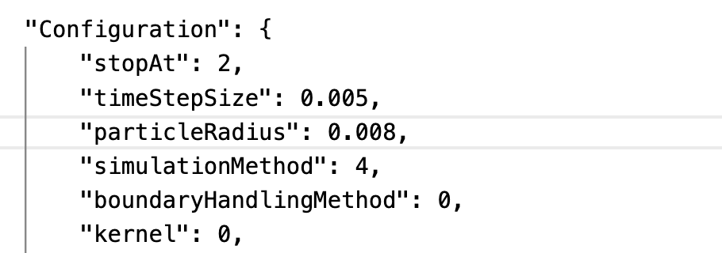

# Scenarios

**Inductiva API** provides a framework for users to create personalized scenarios. Scenarios describe a physical model of a process in nature, that can be simulated. With a scenario, the complexity of configuring the underlying simulators is abstracted away and this allows users to configure only a few parameters to make an exploration of the physical model. All of the other parameters are fixed and stored within the scenario.

As a **user**, you will have the ability to create your own scenarios. A few fundamental blocks are required to create a scenario:
- Choose the simulators you want to use among the ones available via the Inductiva API;
- Template the input files for the simulators;
- Construct a Python class based on Inductiva API.

In this repository, we present two examples of scenarios that simulate the motion of fluid in a cubic tank using SPH: the `DamBreak` and the `FluidBlock` scenarios.

The scenarios contained in this demo are meant to **inspire** the creation of personalized scenarios.
Together, with the scenarios we also show how the outputs can be handled by post-processing methods and visualize the results.

### How to build your scenario?

To build your scenario, you need to create a Python class that inherits from the `Scenario` class. This class will contain the methods to configure the scenario and run the simulation. Let's construct this `Scenario` class step by step for the `FluidBlock`.

##### Template the input files
Let's prepare the template files and directory. Example of a structure:

```
   my_template_directory
   |
   |- sim_config_files
   |   |- fluid_block.json.jinja
   |
   |- extra_input_files
   |- commands.json
```

The template directory can have any name you wish. The simulation configuration files need to be inside a folder named `sim_config_files`. All the files to be templated need to contain the suffix `.jinja`, otherwise they won't be modified. For some simulators, a file with the commands can also be provided in the root of the template directory. This file can also be templated. Other extra files can be added as you wish to the template directory.

###### Example of template file

To template a file you will need to substitute the values that were for the simulation with `{{ parameter_name }}`. For example, the `fluid_block.json` file can be templated as:
<div style="display: flex; justify-content: space-between;">
<div>
    <h7>Input File</h7>
    
</div>
<div>
    <h7>Template file</h7>
    
</div>
</div>

With the parameters templated, we can now create the `FluidBlock` scenario.

##### Create the scenario class

The scenario class will inherit from the base `Scenario` class from **Inductiva API**.

The class contains the following methods:
-   `__init__`: Initializes the scenario with the parameters of the physical model;
-   `simulate`: Launch the simulation of the physical model and adjust the simulation parameters;

The parameters that were templated in the input files are now the arguments for both the `__init__` and `simulate` methods. Each of these parameters needs to be added to `params` attribute of the base class. A simple example for the `FluidBlock` scenario, the `__init__` method will be:

```python
def __init__(self,
             density: float,
             kinematic_viscosity: float,
             dimensions: List[float],
             position: Optional[List[float]] = None,
             initial_velocity: Optional[List[float]] = None):

    self.params["density"] = density
    self.params["kinematic_viscosity"] = kinematic_viscosity
    self.params["fluid_dimensions"] = dimensions
    self.params["fluid_position"] = position
    self.params["fluid_velocity"] = initial_velocity
```

The `simulate` can also be used to template parameters and in the end uses the inherited method to launch the simulation with both these parameters and the ones above. Moreover, it inherits three important arguments from the base class: `simulator`, `machine_group` and `storage_dir`. The `simulator` sets the simulator to be used, the `machine_group` is the group of machines used to run the simulation and the `storage_dir` is the directory where the simulation files will be stored in the cloud. Other arguments, specific of the simulator can also be passed to the `simulate` method.

```python
def simulate(
    self, simulator = inductiva.simulators.SplishSplash(),
    machine_group = None, storage_dir = "", particle_radius = 0.02,
    simulation_time = 1, time_step: float = 0.001, output_export_rate = 60):

    self.params["particle_radius"] = particle_radius
    self.params["simulation_time"] = simulation_time
    self.params["adaptive_time_step"] = adaptive_time_step
    self.params["particle_sorting"] = particle_sorting
    self.params["time_step"] = time_step
    self.params["output_export_rate"] = output_export_rate

    commands = self.get_commands()

    task = super().simulate(
        simulator=simulator,
        machine_group=machine_group,
        storage_dir=storage_dir,
        commands=commands,
        sim_config_filename="fluid_block.json")

    return task
```

This is a simplification of the `DamBreak` and `FluidBlock` scenarios, where more simulator options are available within the same scenario.

To learn more on how to create your scenarios, check the [documentation](https://github.com/inductiva/inductiva/wiki/Build-your-own-scenario).

### Dam break scenario

This scenario simulates the motion of a fluid block under the effect of gravity.
The simulators available are [SPlisHSPlasH](https://github.com/inductiva/inductiva/blob/main/inductiva/simulators/splishsplash.py) and [DualSPHysics](https://github.com/inductiva/inductiva/blob/main/inductiva/simulators/dualsphysics.py), which use the [Smoothed Particle Hydrodynamics](https://en.wikipedia.org/wiki/Smoothed-particle_hydrodynamics) formulation to model the fluid.

One can initialize the scenario with different fluids (Water, Honey, Olive oil) and with fluid blocks of different dimensions and initial positions. Then, users can further configure the simulation time and resolution.

##### Example

We have prepared a Python script to directly run this scenario. Get inside the scenario folder and run the following command:

```bash
python3 dam_break_run.py
```

Or, prepare your own and start changing the parameters. The script should be inside the scenario folder. Copy the code snippet and get started:

```python
import dam_break
import post_processing
from utils import fluid_types

# Initialize the DamBreak scenario
dam_break = dam_break.DamBreak(fluid=fluid_types.WATER)

# Launch the simulation
task = dam_break.simulate(
    simulation_time=4,
    resolution="medium")

# Wait for the simulation to finish and download the results
task.wait()
output_dir = task.download_outputs()

# Post-process the results and render a video of the simulation
simulation_output = post_processing.SPHSimulationOutput(output_dir)
simulation_output.render(fps=60)
```

<p align="center">
  


### Fluid Block

This scenario is an extension of the DamBreak scenario, where the fluid can have an initial velocity and the simulation can be configured with more parameters. 

To initialize the scenario users can set the density and kinematic viscosity of the fluid, the dimensions of the fluid block, the initial position and the initial velocity. 

The simulation can be configured with the following parameters: the `particle_radius` (float), the `simulation_time` (float), the `adaptive_time_step` (bool), the `time_step` (float) and the `output_export_rate` (int).

Again, the scenario can be run with both `SplishSplash` and `DualSPHysics` simulators via Inductiva API.

##### Example

We have prepared a Python script to directly run this scenario. Get inside the scenario folder and run the following command:

```bash
python3 fluid_block_example.py
```

Or, prepare your own and start changing the parameters. The script should be inside the scenario folder. Copy the code snippet and get started:

```python
import fluid_block
import post_processing

# Initialize the FluidBlock scenario
fluidblock = fluid_block.FluidBlock(
    density=1000,
    kinematic_viscosity=1e-6,
    dimensions=[0.5, 0.5, 0.5],
    position=[0, 0, 0],
    initial_velocity=[0, 0, 0],
)

# Launch the simulation
task = fluidblock.simulate(
    particle_radius=0.02,
    simulation_time=2)

# Wait for the simulation to finish and download the results
task.wait()
output_dir = task.download_outputs()

# Render a video of the simulation
simulation_output = post_processing.SPHSimulationOutput(output_dir)
simulation_output.render()
```

<p align="center">
  
